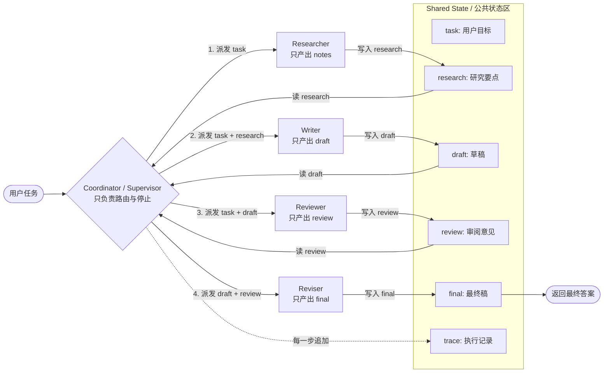
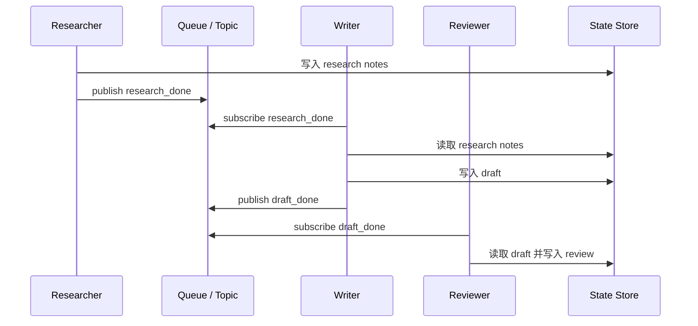
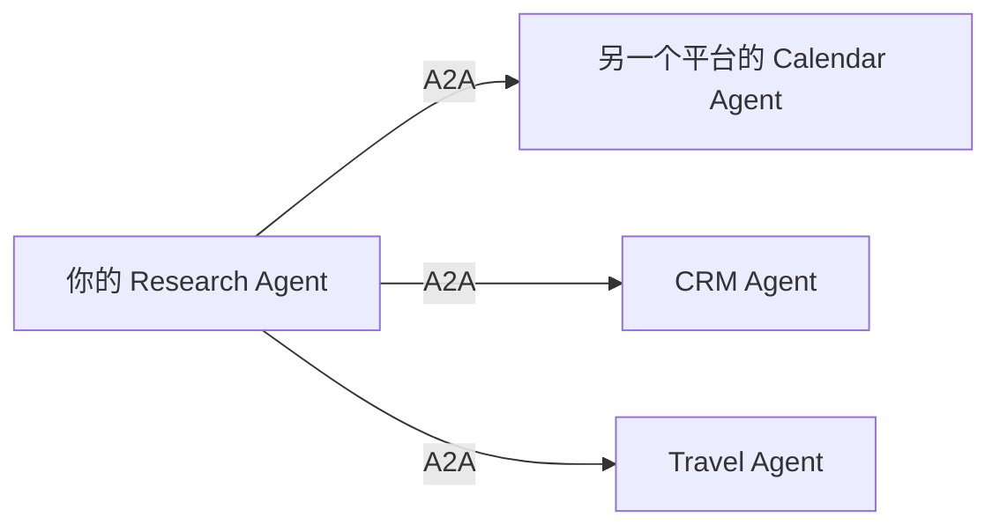

# 多 Agent 交互：A2A 还是共享状态？

Stage 4 的核心判断：

> 真实工程里的多 agent，大多数不是先用 A2A；更常见的是 **coordinator + shared state / artifact store / message bus**。A2A 更适合不同系统、不同组织、不同 runtime 的 agent 互操作。

这篇笔记回答一个关键问题：多个 agent 到底是互相发消息，还是通过公共区域读写内容？

---

## 1. 先给结论

| 场景 | 更常见做法 |
| --- | --- |
| 同一个应用内部的多个 agent | coordinator + shared state |
| 内容生产链路（research -> write -> review） | pipeline / supervisor |
| 长任务、异步任务 | queue + state store |
| coding agent 协作 | 文件系统 + git diff + trace |
| 不同平台 / 不同厂商 agent 通信 | A2A |

所以，如果你在同一个 repo 里做：

```text
research -> write -> review -> revise
```

通常不需要 A2A。先用一个 coordinator 控制流程，把中间产物写进共享状态即可。

---

## 2. 最常见架构：Coordinator + Shared State



在这个模式里，agent 之间不是自由聊天，而是：

1. coordinator 选择下一步；
2. 当前 agent 读取任务和必要状态；
3. 当前 agent 只写自己的输出；
4. coordinator 把输出写回 shared state；
5. trace 记录每一步。

对应 Stage 4 的代码：

```text
coordinator.py
  MultiAgentState
    research
    draft
    review
    final
    trace
```

这就是“公共区域读取相关内容”的模型。

---

## 3. 为什么不让 Agent 直接互相聊天？

自由聊天看起来像这样：

```text
planner: 我觉得先查资料。
writer: 可以，我等你。
reviewer: 我也可以看看。
planner: 那 researcher 你怎么看？
researcher: 我觉得还需要更多信息。
...
```

问题很快出现：

- 谁决定下一步？
- 谁拥有最终答案？
- 中间产物存在哪里？
- 怎么防止重复争论？
- 怎么回放和调试？
- 失败后从哪一步恢复？

工程上更稳定的方式是：

```text
agent 不自由聊天
agent 只读输入、写输出
coordinator 决定下一步
state store 保存中间产物
trace 记录每一步
```

---

## 4. Shared State 可以是什么？

Shared State 不一定是一个 Python 对象。真实系统里常见几种形态：

| 形态 | 例子 | 适合场景 |
| --- | --- | --- |
| 内存对象 | `MultiAgentState` | 教学 demo / 单进程 |
| 数据库 | SQLite / Postgres / Redis | 可恢复任务、Web app |
| 文件系统 | `research.md` / `draft.md` / `review.md` | coding agent、文档工作流 |
| Artifact Store | S3 / OSS / 本地 artifacts | 大文件、报告、图片、日志 |
| Message Bus | Redis Stream / Kafka / RabbitMQ | 异步多 agent |

它们本质上都在做一件事：**把 agent 的输出变成其他 agent 可读取的输入**。

---

## 5. Message Bus 也是共享通信层

异步场景常用 message bus：



注意：这仍然不是 A2A。它只是应用内部的事件驱动架构。

---

## 6. A2A 解决的不是同一个问题

A2A 更像是“跨系统 agent 互操作协议”。

它关心的问题是：

- 另一个 agent 有什么能力？
- 怎么发现它？
- 怎么发起任务？
- 怎么跟踪任务生命周期？
- 怎么传 artifact？
- 怎么处理身份、鉴权、跨组织调用？

更像：



也就是说：

```text
同一个系统内部编排：coordinator + shared state
不同系统之间互操作：A2A
```

---

## 7. A2A、MCP、Shared State 的区别

| 概念 | 主要关系 | 解决什么 |
| --- | --- | --- |
| Shared State | agent ↔ 应用状态 | 同一系统内交换中间产物 |
| MCP | agent ↔ tool / data source | 标准化调用工具和外部数据 |
| A2A | agent ↔ agent | 跨系统 agent 发现、任务和结果交换 |

简单判断：

- “我要查数据库 / 文件 / 浏览器” → MCP / tool
- “我要让 writer 读 researcher 的结果” → shared state
- “我要调用另一个平台的 agent” → A2A

---

## 8. 和 Stage 4 代码怎么对应？

Stage 4 当前实现的是最小的 shared state 模式：

```text
用户任务
  -> supervisor 选择 next role
  -> researcher 写 state.research
  -> writer 读 state.research，写 state.draft
  -> reviewer 读 state.draft，写 state.review
  -> reviser 读 state.draft + state.review，写 state.final
  -> trace 记录全过程
```

对应文件：

- `roles.py`：定义每个角色的职责边界；
- `agents.py`：把角色变成可调用函数；
- `coordinator.py`：决定谁执行、写入 shared state；
- `agent.py`：最终 demo；
- 本文：解释为什么 Stage 4 不直接使用 A2A。

---

## 9. 工程建议

### 初学多 agent

先不要上 A2A。优先实现：

```text
RoleSpec + SharedState + Coordinator + Trace + MaxSteps
```

这能覆盖 80% 的学习重点。

### 做生产多 agent

先回答这些问题：

- 状态存在哪里？
- 中间产物如何版本化？
- 每一步如何回放？
- 谁决定下一步？
- 每个角色的输入输出 schema 是什么？
- 失败后从哪一步恢复？

这些问题解决前，上 A2A 只会增加复杂度。

### 什么时候值得学 A2A

当你要做：

- 不同产品之间的 agent 协作；
- 企业内部多个 agent 服务互相调用；
- agent marketplace；
- 跨组织、跨 runtime 的 agent interoperability；
- 需要 agent capability discovery 的系统。

这时 A2A 才是核心。

---

## 10. 一句话总结

```text
多 agent 内部协作，主流是 coordinator + shared state；
A2A 更适合跨系统 agent 通信。
```

Stage 4 先学 shared state 是合理的。Stage 5 再学 MCP / A2A / ACP，会更自然。
