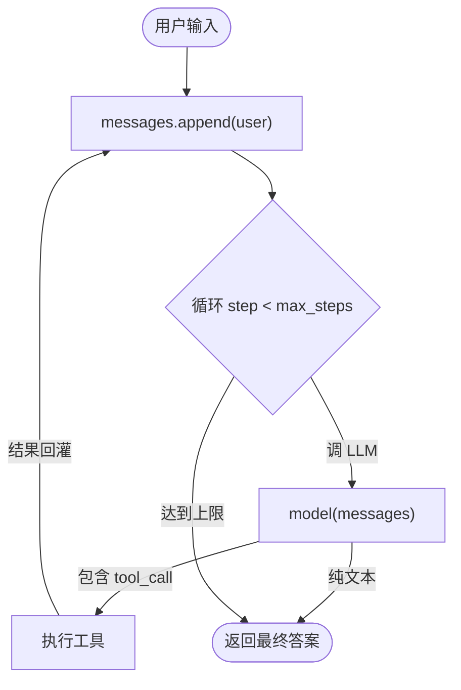

# 最小 Agent Loop：为什么 50 行就够了

Stage 1 的核心判断：

> Agent 能力的下限由 loop 决定。先把「能选工具、能执行、能循环」的最小 loop 跑通，再谈任何框架。

这篇笔记回答：为什么一个 50–150 行、不依赖任何 agent 框架的 loop，已经覆盖了 agent 80% 的本质。

---

## 1. 先给结论

| 你以为 agent 需要的 | 最小 loop 实际需要的 |
| --- | --- |
| 复杂的 planner / memory 模块 | 一个 `while` 循环 |
| 一堆框架抽象 | 一个 `messages` 列表 |
| 向量库才能"记忆" | 把历史留在 `messages` 里就够起步 |
| 高级调度 | `max_steps` 上限 + 工具结果回灌 |

框架在后面帮你的是工程化（权限、trace、并发），而不是 loop 本身。

---

## 2. 最小 loop 长什么样



对应的骨架（伪代码）：

```python
messages = [system_prompt, user_message]
for step in range(max_steps):
    resp = model(messages)
    if resp.has_tool_call:
        result = run_tool(resp.tool_call)
        messages.append(tool_result)
    else:
        return resp.text
```

关键点只有三个：**循环**、**工具执行**、**结果回灌**。

---

## 3. 为什么不要一上来用框架

框架的抽象会掩盖 loop 的真实成本：

- 你以为"agent 很聪明"，其实是 `messages` 列表在变长；
- 你以为"它能规划"，其实是 `max_steps` 给了它重试机会；- 你以为"它记住了"，其实是上下文里还留着历史。

先手写一遍 loop，你才会真正理解后面 Stage 3 的 harness 在解决什么（权限、压缩、子 agent 都不是 loop 本身的问题）。

---

## 4. 常见误区

- **把 loop 写成一大坨**：system prompt、工具定义、循环逻辑搅在一起，改一处崩一片。拆成 `common.py` / `tools.py` / `agent.py`。
- **忘记 `max_steps`**：模型一旦反复调工具就死循环，GPU 烧钱还不出结果。
- **不返回结构化结果**：让模型只输出自然语言，下游无法解析。要求 JSON 或固定字段。
- **工具不校验输入**：把用户字符串直接拼进 shell。Stage 8 会讲安全边界，但 Stage 1 就该有基本卫生。

---

## 5. 工程建议

最小 loop 至少加三样东西：

```text
max_steps    # 防死循环
timeout      # 防单次卡死
error handle # 工具失败时不崩，返回错误文本回灌模型
```

对应代码见 `stage-1/step05_agent_loop.py`。跑通后，再往 loop 里塞 RAG（Stage 2）、记忆（Stage 9）。

---

## 6. 自测题

1. 如果把 `max_steps` 设成 1，agent 还能完成多步任务吗？为什么？
2. 工具结果回灌时，应该把"原始输出"还是"摘要"放进 `messages`？各有什么代价？
3. 模型返回了 tool_call 但参数非法，最小 loop 应该怎么处理才不会中断？
4. 为什么说"框架帮的是工程化而不是 loop 本身"？举一个 Stage 3 harness 才解决的问题。
