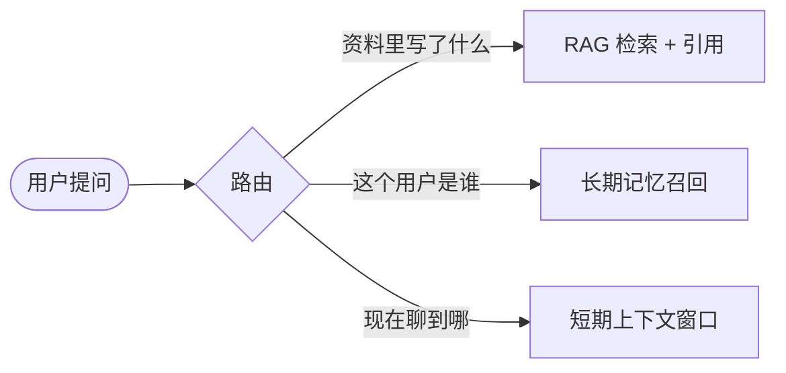

# RAG、记忆与上下文：三层不要混

Stage 2 的核心判断：

> 短期上下文、会话记忆、长期记忆是三种不同的东西。用一套机制解决所有，迟早出问题。

这篇笔记把"模型到底从哪里拿到信息"拆成三层，并说明 RAG 不属于其中任何一层记忆。

---

## 1. 先给结论

| 层 | 存什么 | 生命周期 | 典型实现 |
| --- | --- | --- | --- |
| 短期上下文 | 当前对话的 `messages` | 本轮会话 | 模型上下文窗口 |
| 会话记忆 | 本轮任务的临时状态 | 本次任务 | state 对象 / 草稿文件 |
| 长期记忆 | 用户事实 / 偏好 | 跨任务持久 | mem0 / 向量库 / JSON |
| RAG | 外部文档检索 | 按需 | 向量库 + 引用 |

一句话：**RAG 查资料，记忆记用户，上下文是当前窗口**。

---

## 2. 三层怎么分工

它们互相不替代：

- 把"用户偏好"塞进 RAG 文档 → 检索噪声、召回不准；
- 把"当前对话"写进长期记忆 → 记忆被临时废话污染；
- 把"外部知识"全堆进 system prompt → 撑爆窗口、变贵。

---

## 3. 常见误区

- **用 RAG 当记忆**：RAG 解决"文档里有什么"，记忆解决"用户是谁"。混用会让记忆充满无关文档片段。
- **把 system prompt 当数据库**：prompt 里硬塞几百条用户事实，既贵又易被压缩丢掉。
- **认为上下文 = 记忆**：上下文窗口会随压缩清空，长期记忆必须落库才跨会话。
- **记忆只写不读**：`add_memory` 之后从不 `search`，等于没记。

---

## 4. 工程建议

- 先分清"这次要查资料"还是"这次要记用户"，再选机制；
- 长期记忆优先用 `user_id` 隔离，避免不同用户互相污染；
- RAG 回答务必带引用（`[1][2]`），无资料时明确说"未找到"；
- 上下文压缩（Stage 9）只动短期层，别动长期记忆。

对应代码见 `stage-2/step01_memory_layers.py`（三层区分）与 `stage-2/step05_mem0_memory.py`（长期记忆）。

---

## 5. 自测题

1. "用户喜欢用 Python" 该进 RAG、长期记忆、还是上下文？为什么？
2. RAG 和 mem0 的最大区别是什么？分别适合什么查询？
3. 如果长期记忆里混入了"本次对话的临时结论"，会有什么后果？
4. 为什么"带引用"对 RAG 答案很重要？
