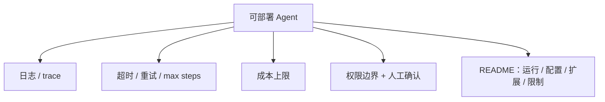

# 从 Demo 到可部署 Agent

Stage 8 的核心判断：

> 能 clone 下来跑起来的 agent，才算交付。demo 跑通只是开始，不是终点。

这篇笔记把"玩具 agent"和"能上线的 agent"之间的工程差距列清楚。

---

## 1. 先给结论

| Demo 阶段 | 可部署阶段 |
| --- | --- |
| 手动跑一次 | 有固定入口（CLI / Web / Slack / Action） |
| 出错就崩 | 有日志、trace、重试、超时 |
| 无成本概念 | 有成本上限 |
| 危险操作直接做 | 有权限边界 + 人工确认 |
| 只有代码 | 有 README：怎么跑、怎么配 key、怎么扩展、有哪些限制 |

---

## 2. 交付清单

对应 `stage-8/` 的文件：`common.py`（配置/成本）、`tools.py`、`safety.py`、`agent.py`、`cli.py`、`step01_smoke.py`。

---

## 3. 常见误区

- **无超时 / 无 max steps**：一个卡死的任务拖垮整个服务。
- **无成本上限**：agent 疯狂调模型，账单爆炸。
- **危险工具无确认**：删文件、发邮件、付款直接执行，出事无法挽回。
- **没有 README**：别人 clone 下来不知道填什么 key、怎么运行。

---

## 4. 工程建议

- 先定"明确用户、明确任务、明确成功标准"，再谈部署；
- 所有外部副作用（写、发、付）走 `safety.py` 的三级门禁；
- 部署形态按场景选：本地 CLI、Web app、Slack bot、GitHub Action 或后台任务；
- 保留 trace，出问题能回放"失败发生在哪一步"。

对应代码见 `stage-8/`。

---

## 5. 自测题

1. demo 和"可部署 agent"最关键的三条工程差距是什么？
2. 成本上限应该放在哪一层？为什么不能只靠"少用点"？
3. 哪类工具必须加人工确认？举三个。
4. 没有 trace 时，一次失败你最多能猜到什么程度？
