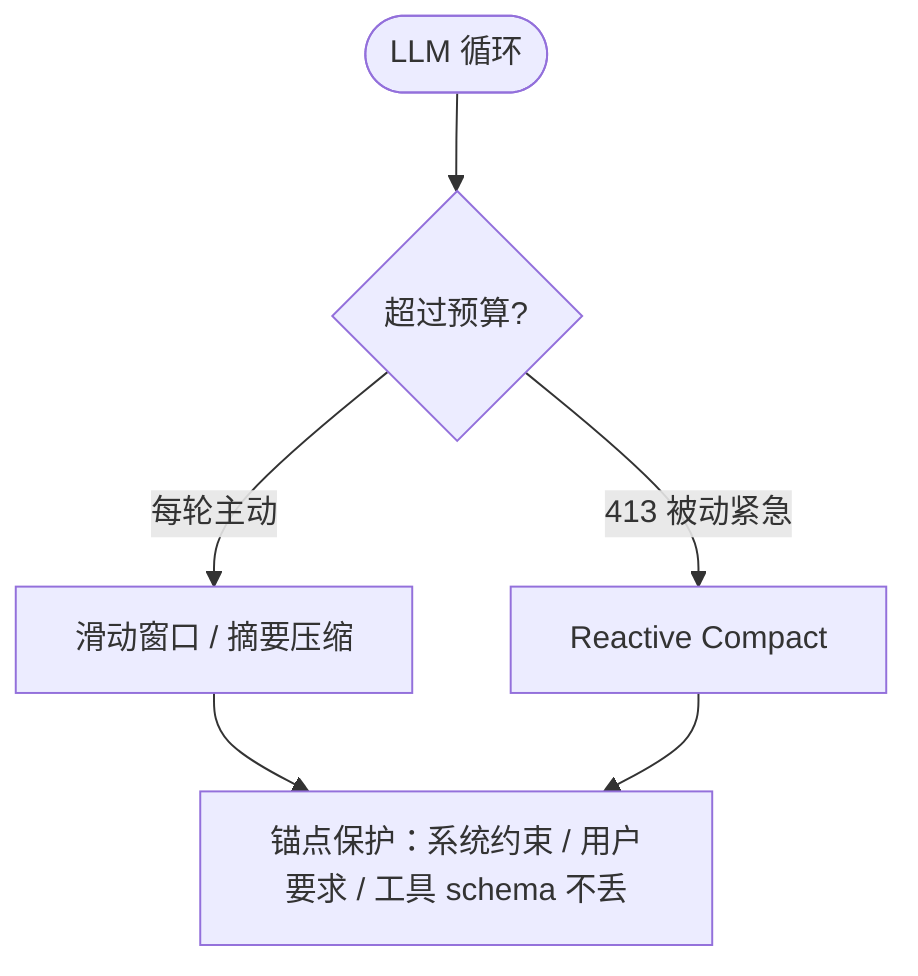

# 上下文压缩与记忆：长会话为什么不爆窗

Stage 9 的核心判断：

> 上下文是长任务的瓶颈。压缩控制"当前窗口"大小，记忆保留"跨任务事实"，两者都靠锚点 / 隔离来保护关键信息。

这篇笔记对应 `stage-9/` 的代码，解释为什么长会话必须压缩、记忆为什么不能和 RAG 混为一谈，以及"锚点"为什么是压缩的安全阀。

---

## 1. 先给结论

| 机制 | 解决什么 | 类比 |
| --- | --- | --- |
| 上下文压缩（Compaction） | 当前窗口无限增长撑爆 token | Claude Code 的 `/compact` |
| 长期记忆（Memory） | 用户事实 / 偏好跨任务丢失 | 用户档案（mem0 这类） |

它们不替代：压缩动的是"现在能看见什么"，记忆动的是"以后还能想起什么"。

---

## 2. 压缩的两种触发

对照 [Claude Code 架构流程图](../stage-3/cc流程图.jpg) 的 **Context Compact / Reactive Compact** 节点：



- **主动压缩**：每轮把超预算的旧消息压掉（滑动窗口或摘要）；
- **被动压缩**：碰到 413 / 预算爆了时紧急压缩（救场）；
- **锚点（anchor）**：带 `anchor=True` 的消息永不丢弃——系统约束、用户明确要求、工具 schema 是"不可丢"的。

对应 `stage-9/compactor.py`。

---

## 3. 记忆最小实现

记忆不是 RAG：RAG 查文档，记忆记用户。最小实现就两步：

```text
add_memory(fact, user_id)   # 写一条用户事实，落库
search_memory(query, user_id)  # 召回相关事实
```

对应 `stage-9/memory_store.py`：JSON 持久化 + 中英混排关键词召回（英文按词、中文按字）。要更强可换语义召回（embeddings）。

---

## 4. 常见误区

- **压缩压丢系统约束**：没设锚点，压缩后 agent"忘了自己被禁止做什么"，安全边界失效。
- **把记忆当 RAG**：记忆记用户事实，RAG 查资料；混用让记忆充满文档噪声。
- **压缩 = 截断**：只丢旧的会丢早期重要决策；摘要式能把旧内容压成要点保留。
- **只在短任务想压缩**：短会话看不出价值，50+ 轮才显出 token 节省（见 `step05`）。

---

## 5. 工程建议

- 任何压缩前，先标出锚点：系统约束、用户硬要求、工具 schema；
- 先用滑动窗口跑通，再上摘要式观察信息损失；
- 把 compaction + memory 接进 loop（如 `step05_loop_with_memory.py`），对比有无压缩的 token 消耗；
- 评估压缩质量：压缩后任务成功率是否下降、关键信息是否还在。

对应代码见 `stage-9/`。

---

## 6. 自测题

1. 主动压缩和被动（Reactive）压缩分别解决什么时机的问题？
2. 哪些消息必须标成锚点？不标会怎样？
3. 记忆和 RAG 最大区别是什么？分别适合什么查询？
4. 为什么 50+ 轮的长任务才明显看出压缩的价值？
