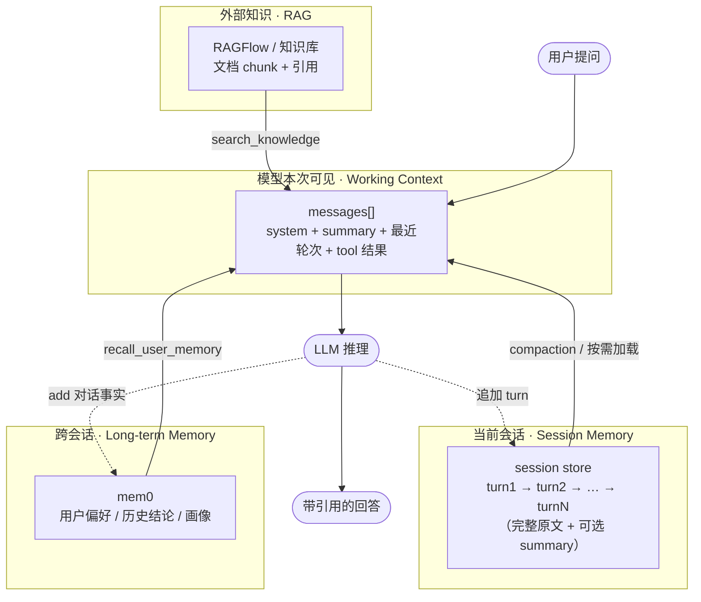
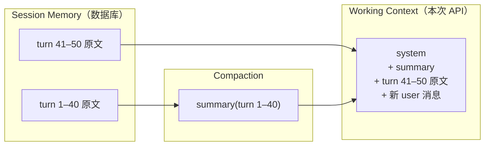
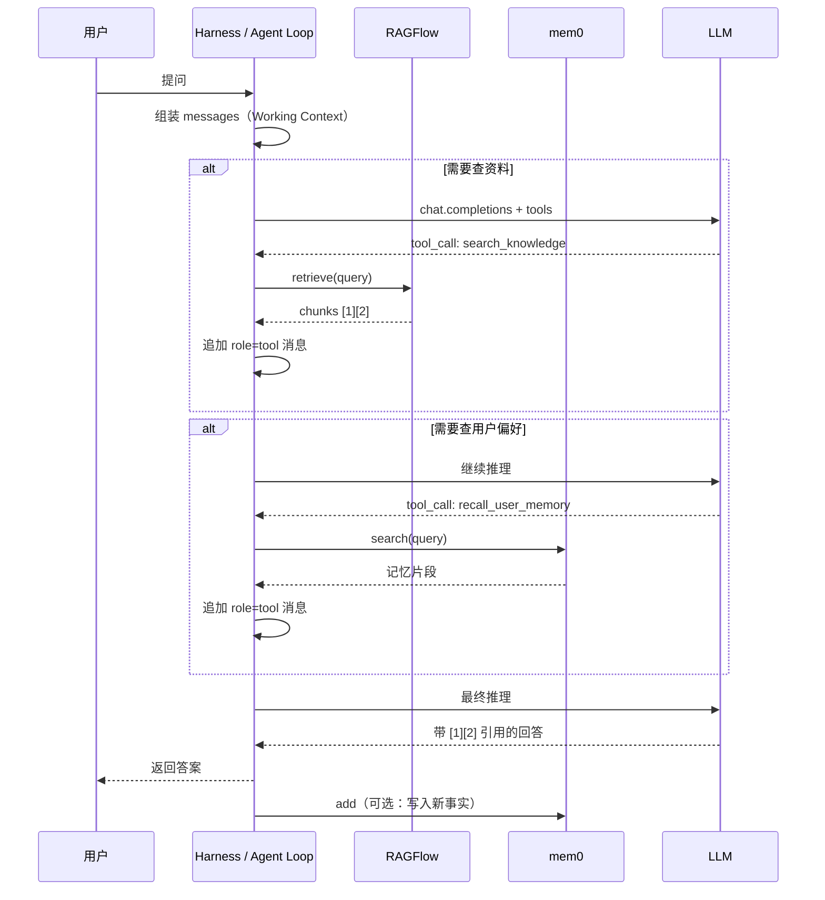
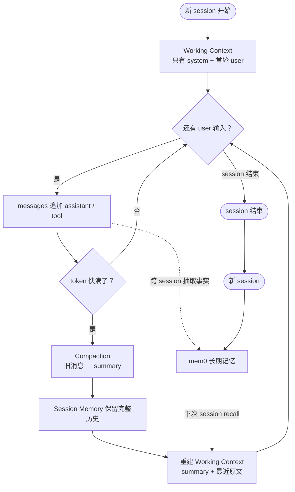
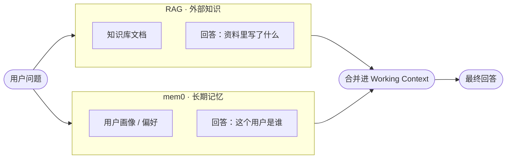

# Agent 记忆分层（教学样例）

## 三种记忆

1. **短期上下文（Working Context）**  
   本次 API 调用里 `messages` 数组的内容——模型**直接可见**的工作台。  
   可以包含：最近几轮原文、更早对话的 summary、system prompt、tool 结果等。  
   容量受 context window 限制；Stage 2 的 `step07` 就是这个列表。

2. **会话记忆（Session Memory）**  
   同一会话（session）从开头到现在的**完整历史**，通常持久化在数据库或 session store。  
   模型默认看不到；harness 每次请求前，从中**按需选取**一部分放进 Working Context。  
   可以存完整原文，也可以存 summary——存什么与会话边界有关，**怎么选进窗口**才是 compaction 的事。

3. **长期记忆（Long-term Memory）**  
   跨会话持久化的事实与偏好，例如「用户叫 Alex、喜欢 Python」。  
   Stage 2 用 **mem0** 实现这一层；和 Session Memory 的区别是**跨越多次聊天**，而不只是当前 session。

---

## 总览：四层信息从哪来

| 层级 | 回答的问题 | Stage 2 对应 |
| --- | --- | --- |
| Working Context | 模型**这次**看到什么？ | `step07` 的 `messages` |
| Session Memory | **这次聊天**发生过什么？ | 教程中简化，Stage 3 harness 补全 |
| Long-term Memory | **这个用户**是谁、偏好什么？ | `mem0` / `step05` |
| RAG | **资料里**写了什么？ | `RAGFlow` / `step03–04` |

---

## 流程 1：Session → Working Context（compaction）

窗口没满时，最近几轮原文可以直接进 `messages`；窗口快满时，harness 从 Session Memory 里**选 + 压**，再组装 Working Context。

要点：

- **Session Memory** = 存（完整档案）
- **Compaction** = 选 + 变（旧消息 → summary）
- **Working Context** = 模型这次能看到的窗口

---

## 流程 2：一次 Agent 请求如何拼上下文

对应 Stage 2 `step07` / `agent.py` 的单轮推理：

Stage 2 当前**已实现**：Working Context + RAG + mem0。  
**未实现**：Session Memory 持久化、compaction（Letta / Claude Code 在 Stage 3 学）。

---

## 流程 3：三种记忆的生命周期

---

## RAG 与记忆的区别

- **RAG**：从外部知识库检索文档片段，回答「资料里写了什么」。
- **长期记忆**：记住「这个用户是谁、之前聊过什么结论」。

两者可以并存：RAG 提供证据，mem0 提供用户画像。
